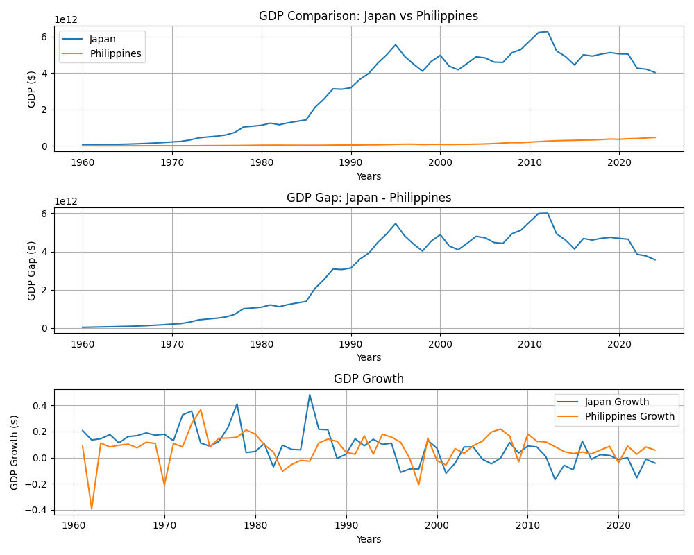

# Japan vs Philippines GDP Analysis
This project compares GDP trends between Japan and the Philippines using World Bank data and Python.

## Tools Used
Python
pandas
matplotlib

## Features
GDP trend comparison
GDP gap analysis
GDP growth rate analysis

## Data Source
World Bank Open Data

## Key Findings
Japan maintained a significantly larger economy throughout the observed period.
The GDP gap widened during Japan's period of rapid economic growth.
The Philippines demonstrated relatively consistent long-term economic growth.
Recent trends suggest gradual convergence between the two economies.

## Visualization

## Future Improvements
Add ASEAN country comparisons
Examine GDP per capita alongside GDP
Analyze economic crises and recovery periods
Create forecasting models
