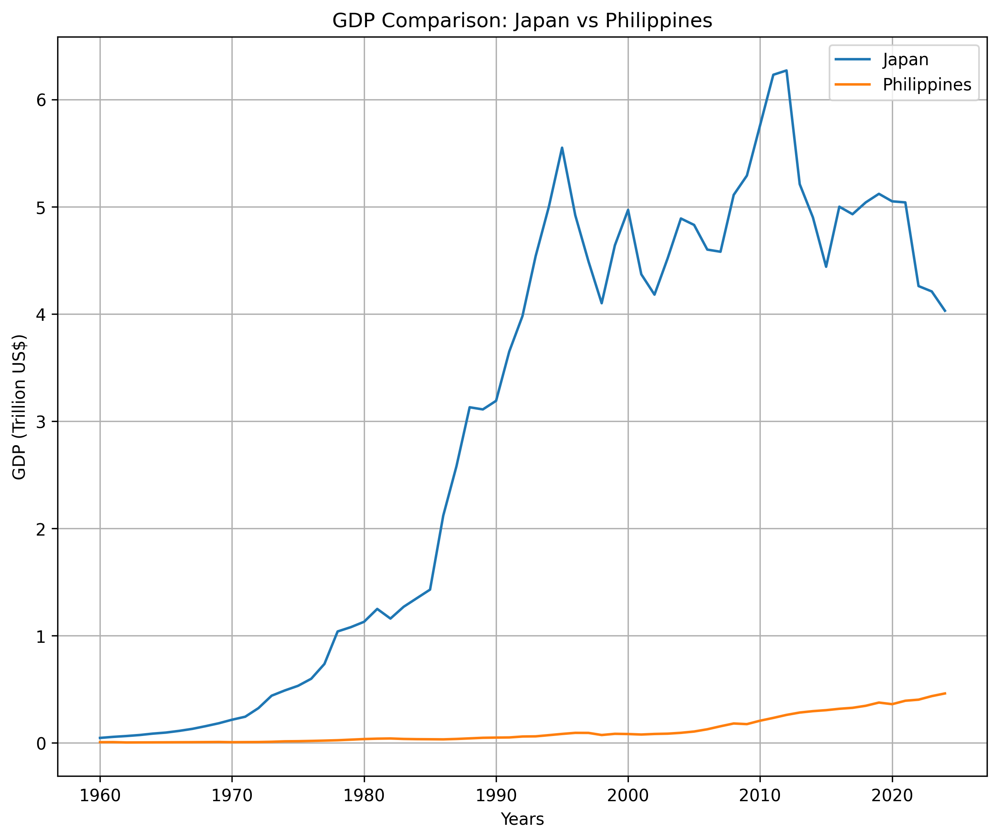
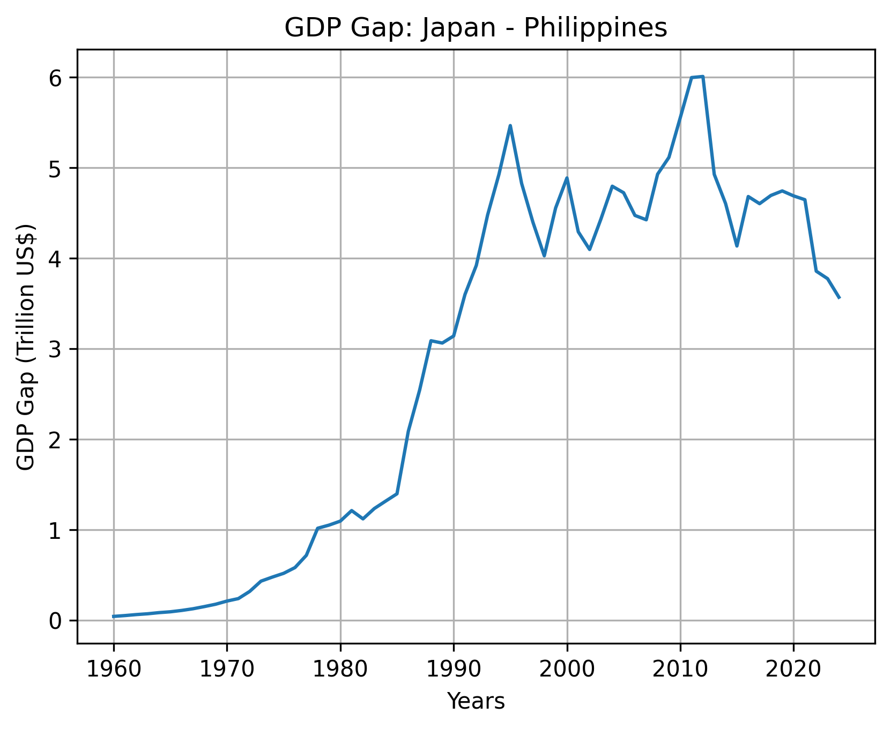
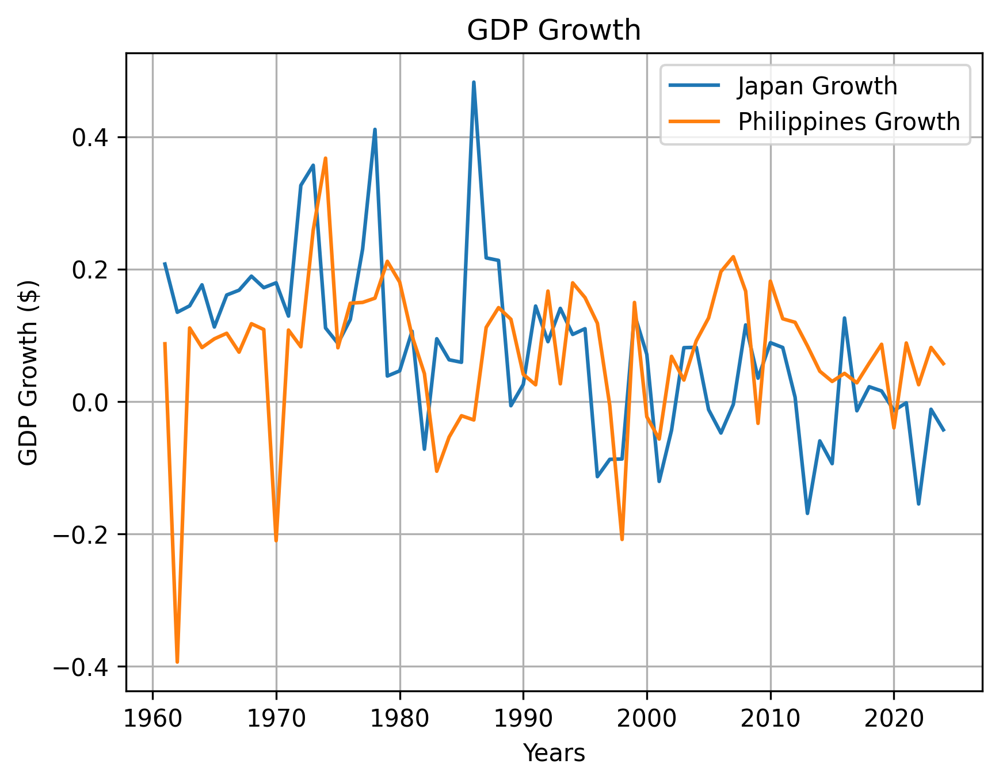
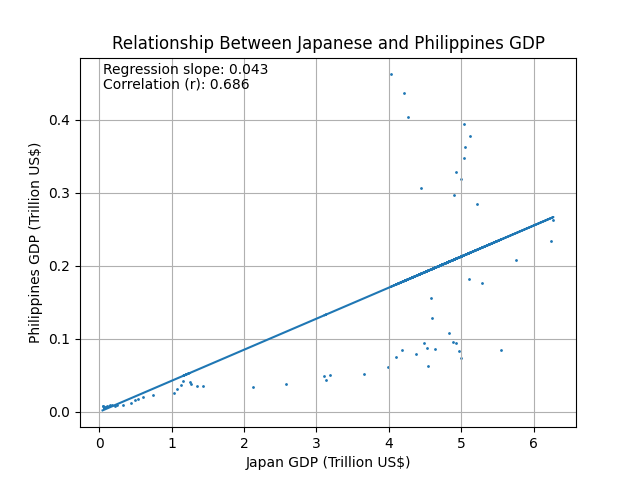

# Japan vs Philippines GDP Analysis
This project analyzes GDP trends in Japan and the Philippines using World Bank data and Python. 
The objective is to compare how the two economies have changed over time and identify major differences in their growth patterns.

## Research Question
* How has GDP changed in Japan and the Philippines over time?
* Which country experienced stronger GDP growth?
* How did major economic events affect GDP?
* What differences can be observed between the two economies?

## Data
**Source**: World Bank
**Countries**: Japan, Philippines
**Indicator**: GDP (Current US$)

## Tools Used
* Python
* pandas
* matplotlib

## Analysis
### 1. GDP Trend Comparison
Compares GDP in Japan and the Philippines over time.
### 2. GDP Gap Analysis
Calculates:
**Japan GDP - Philippines GDP**
Shows the difference in GDP between the two countries.
## 3. GDP Growth Rate Analysis
Examines year-to-year changes in GDP.

## Key Findings
* Japan has a substantially larger overall GDP due to the size of its economy.
* The GDP gap widened during Japan's period of rapid economic growth.
* The Philippines demonstrated relatively consistent long-term economic growth.
* Recent trends suggest gradual convergence between the two economies.
* Comparing total GDP alone does not fully capture differences in living standards, which is why GDP per capita is analyzed separately.

## Visualization
### GDP Comparison

### GDP Gap

### GDP Growth

### Relationship Between Japanese and Philippine GDP

## Future Improvements
* Add ASEAN country comparisons
* Examine GDP per capita alongside GDP
* Analyze economic crises and recovery periods
* Create forecasting models
* Create an interactive dashboard using Power BI

## What I learned
Through this project, I practiced:
* Working with real-world economic data
* Cleaning and organizing datasets using pandas
* Creating data visualizations with matplotlib
* Comparing economic indicators between countries
* Interpreting economic data rather than only producing visualizations

## Future Project
This analysis will eventually be combined with my GDP per capita, unemployment, and inflation projects into a broader:

**Japan 🇯🇵 vs Philippines 🇵🇭 Economic Comparison Dashboard**

using Python, SQL, and Power BI.
